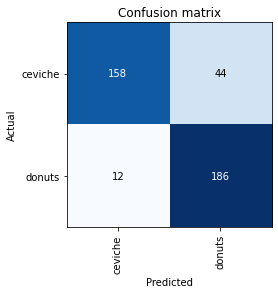
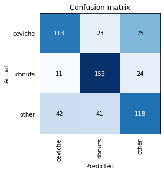
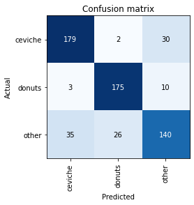

# Food Classifier

Goal: Build a classifier that accepts an unknown picture and classifies it as ceviche or donut

## Questions / Concerns / Assumptions

How do we deal with images that are neither donut or ceviche?

- Rekognition tag for 'food' as first filter
- Labelled dataset of 'other' images, inc a range of food items that may resemble ceviche & donut such as tacos, salsa, bagel, muffin

How do we deal with images that are obscured, e.g. food item is in a busy environment with other things

- Image augmentation inc cropping, colour changing to make model more adaptable
- Crop images to just dish using bounding boxes to eliminate background noise

How do we assess words, such as the word 'doughnut' on packaging vs an image of the food item itself?

- Could make the assumption that only images of food are valid
- Run through a preliminary classifier to identify food vs non-food items. Rekognition has 'food' as a label
- Explore how rekognition handles words - Beware of the Apple iPod situation 

Do we prioritise precision or recall? Which is more important in this situation?

- If it's for unsupervised data tagging then precision is the priority
- If it's for suggested tags then recall can be prioritised

How can we improve model?

- More data
- Transfer learning
- Reinforcement

### Labelling

1000 ceviche image
1000 donut images
other images?
Can use free APIs to expand on the current dataset

### Data

Resize all images to same file type & same pixels
Shuffle labelled data & split into test, train, validation sets

### Modelling

FastAI, Pytorch, Keras

I have used fastai before. Contains augmentation packages

Train model
Test model
Rinse & repeat

### Validation

Validate on untouched dataset
Need a baseline metric to compare to - Compare to randomised label

### Unit Tests

Set of example images. Feed into model. Check output is expected values.
Edge cases: Provide some harder images

### Production

Small dataset so CPU might be ok, but may run on GPU
Try running locally
Run on EC2 instance
How much storage will I need?
Jupyter Lab - Jupyter Notebook
Run inside a docker container to avoid dependency issues
Consider that tags and model outputs may change with time (changes in data, retraining models) - Need unit tests

### Versioning

Versioning:

v1 - food-classifier-20220123_2034

- NUM_EPOCHS = 2
- BATCH_SIZE = 16
- VALIDATION_PCT = 0.2
- LABELS = ['ceviche','donuts']
- IMAGE_RESIZE_WIDTH = 80
- IMAGE_RESIZE_HEIGHT = 80
- tfms = aug_transforms()
- ERROR_RATE = 0.14

v2 - food-classifier-20220123_2304

- 'other' dataset built of all other food images in Food-101 dataset. 1000 images, same size as 'ceviche' and 'donuts' datasets.
- LABELS = ['ceviche','donuts','other']
- all else same as above
- ERROR_RATE = 0.36

v3 - food-classifier-20220124_2202.pth

- Ran on GPU
- 'other' dataset built of all other food images in Food-101 dataset. 1000 images, same size as 'ceviche' and 'donuts' datasets.
- NUM_EPOCHS = 4
- BATCH_SIZE = 32
- IMAGE_RESIZE_WIDTH = 256
- IMAGE_RESIZE_HEIGHT = 256
- all else same as above
- ERROR_RATE = 0.18

### TO DO

List of things to do:

- Output Rekognition tags for donuts
- Donuts vs Ceviche - no alternatives
- Donuts, Ceviche or Neither
- Augment images for larger dataset
- Download images from API for larger dataset
- Run provided donut images through Rekognition. See if identified correctly, which tags come back
- Run ceviche and donut through Rekognition. See if 'food' tag is returned
- Split into test, train, validate
- Run ceviche and donut through fastai to train a model
- Validate model
- Create unit tests
- Tune hyperparameters
- Try augmenting images, see if model improves
- Try downloading more images for a larger dataset to train on

### Reading List

- This paper achieved 61.4% accuracy. Explains development of pretrained models (ImageNet > GoogleNet > ResNet). ImageNet has limited food labels & pretrained model only allowed for research (non-commercial use). Mentions Food-101 dataset. Best results from InceptionV3 model in Keras. https://cs230.stanford.edu/projects_fall_2019/reports/26233496.pdf
- Food-101 dataset contains labels for ceviche & donuts (woohoo!) - Looked into Food-101 and have realised where the test images came from (insert sad trombone sound effect) https://github.com/alpapado/food-101/blob/master/data/meta/labels.txt
-  https://keras.io/api/applications/inceptionv3/
- ResNet50 takes 156x156 images. https://towardsdatascience.com/beginners-guide-on-image-classification-vgg-19-resnet-50-and-inceptionresnetv2-with-tensorflow-4909c6478941